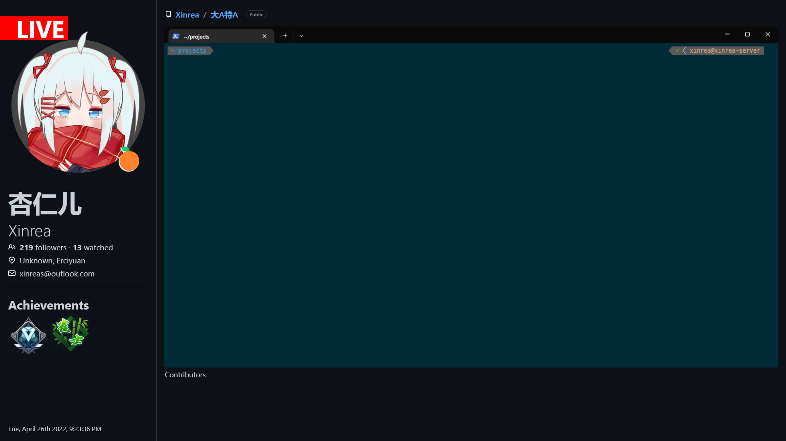

# XOBS Scene Server



使用 web 制作的 OBS 直播场景，便于实现一些动态数据的显示。

[我的 Bilibili直播间](https://live.bilibili.com/843610)

## 使用方法

```
docker run -it -d -p 80:8080 ghcr.io/xinrea/xobs-scene-server:latest YOUR_SERVER_ADDRESS
```
